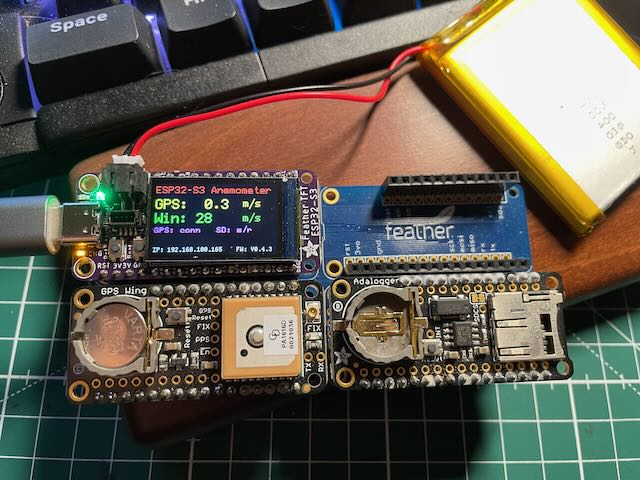
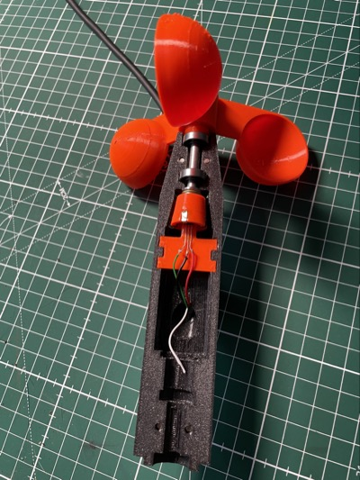

# ESP32-S3 Espressif based 3D printed Anemometer

## About

This project will replace my broken anemometer (wind speed and wind direction sensor). The project is structured into two parts a.) a calibration solution which uses GPS to calibrate the sensor and b.) a production version which will be embedded into the 3D printed anemometer. The anemometer will be connect through Wifi with AWS to send (MQTT) measurements to the cloud where a web site is hosted. Given that the anemometer will be mounted on the roof of my house, it is important to be able to update the device without connecting a computer to it. Therefor OTA is implemented. The device can be updated by sending a MQTT message. The device downloads the requested firmware version from an AWS S3 bucket. All communication is secured using mutual TLS authentication. I'm also planning to power the device with a battery and a solar cell, that will require the implementation of a power management approach utilizing the low power modes of the used MCU.

## Scope

### Technical
- Reliable wifi connection, automatic reconnect (same for MQTT)
- MQTT transport of sensor data to AWS IoT core
- OTA update through HTTPS from AWS S3
- SNTP client to enable X.509 certificate validation and time stamping of measurement data
- NeoPixel for Wifi connection status indication
- IRQ routine to record anemometer rotation pulses (not decided if this will be ESP32-S3 and ULP)
- Local web server on the device for instant data
- All configuration data, specifically the AWS related configuration is stored in a separate partition in the NVM
- The application is written in Rust leveraging the ESP IDF framework
- The production and calibration use cases both use an ESP32-S3 MCU. The main reason not to use the ESP32-C3 is it's 4MB flash size limit which is too small to enable OTA functionality
- For production a [TinyS3 from UM](https://esp32s3.com/tinys3.html) is used as this is the smallest ESP32-S3 I've found

### Functional
- HTML page for providing current wind speed and direction
- Data feed to AWS where an external web interface is hosted
- The firmware supports multiple anemometer instances, as device specific information is stored outside of the fw image

### Functional for calibration use-case
- TFT to display current GPS and current wind speed
- Serial connection to a GPS receiver
- Recording of anemometer rotation speed and GPS data on a Micro SD card

## What is working
- Reliable wifi re-connect. When the wifi connection gets dropped, a re-connection process is started. When an IP address is received the HTTP Server is started again.
- HTTP Server
- OTA firmware download from AWS S3
- MQTT (sending data from the device, control the device OTA / reset) connection to AWS IoT core
- NVS for configuration storage
- Support for Adafruit Feather ESP32-S3 TFT display controller ST7789 (similar to ST7735). Implementation approach uses [mipidsi driver](https://github.com/almindor/mipidsi) 
- Output of GPS speed on TFT
- Logging of GPS NMEA sentences and anemometer rotation speed (rps) to SD card
- Rotation speed of anemometer processing and exposing through web interface (/windspeed)

## Todo List
- [x] Support for Adafruit [Ultimate GPS FeatherWing](https://learn.adafruit.com/adafruit-ultimate-gps-featherwing) to support the calibration process for the wind speed parameters. This is only required for the calibration use-case.
- [x] Support for Adafruit [Adalogger FeatherWing](https://learn.adafruit.com/adafruit-adalogger-featherwing) to log wind speed and GPS data. Interface through [Embedded SD/MMC](https://github.com/rust-embedded-community/embedded-sdmmc-rs). This is only required for the calibration use-case.
- [x] Evaluate pros and cons for using ESP32-S3 vs ESP32-C3 (power consumption, sleep, local web server, OTA needs to be considered)
- [x] ISR & event counting for windspeed sensor
- [x] Fully implement the feature approach to separate the calibration use case from production use case. The image for calibration is too large to allow OTA. Display, GPS and SD Card are not required for production. The solution has been split into a calibration and production solution.
- [x] Implement configuration settings for production in a seperate NVS partition
- [x] Add support for SNTP for production use case
- [ ] Modify existing AWS IoT interface to deal with wind only data (not the full weather dataset which is currently processed)
- [x] Implement MQTT for data ingress to AWS
- [ ] Implement sleep mode (which one ?)
- [ ] Calibration of the anemometer
- [ ] Implement new UI for the AWS lamda based weather station App

## Hardware Images

The board-setup used for the calibration use-case:

The 3D printed anemometer:

 

## License

Licensed under either of

- Apache License, Version 2.0 ([LICENSE-APACHE](LICENSE-APACHE) or
  http://www.apache.org/licenses/LICENSE-2.0)

- MIT license ([LICENSE-MIT](LICENSE-MIT) or http://opensource.org/licenses/MIT)

at your option.
