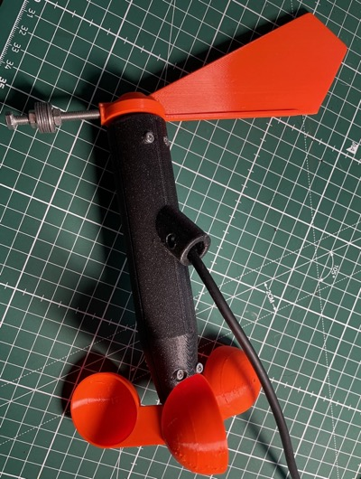

# ESP32-C3 / S3 Espressif based 3D printed Anemometer

## About

This experiment uses IDF OTA functionality in Rust on an Adafruit ESP32-S3 TFT Board

This is WIP - should lead to a sensor node for an anemometer. The anemometer needs to be calibrated. This will be done by moving (driving) the anemometer an comparing the rotation speed with parallel recorded GPS signal.

## Scope
### Technical
- relayable wifi connection, automatic reconnect
- MQTT transport of sensor data
- OTA update
- NeoPixel for Wifi connection status indication
- IRQ routine to record anemometer rotation pulses (not decided if this will be ESP32-S3 and ULP or ESP32-C3 and standard IRQ based)

### Functional
- HTML page for OTA update
- HTML page for providing current wind speed and direction
- Data feed to AWS where an external web interface is hosted
- WIFI parameter configuration through bluetooth

### Functional for calibration use-case
- TFT to display current GPS and current wind speed
- Serial connection to a GPS receiver
- Recording of anemometer rotation speed and GPS data on a Micro SD card

## What is working
- Reliable wifi re-connect. When the wifi connection gets dropped, a re-connection process is started. When an IP address is received the HTTP Server is started again.
- HTTP Server
- OTA
- Support for Adafruit Feather ESP32-S3 TFT display controller ST7789 (similar to ST7735). Implmentation approach uses [mipidsi driver](https://github.com/almindor/mipidsi) 
- Output of GPS speed on TFT
- Logging of GPS NMEA sentences and anemometer rotation speed (rps) to SD card
- Rotation speed of anemometer processing and exposing through web interface (/windspeed)

The current OTA code is inspired by https://github.com/bakery/rust-esp32-std-demo/tree/feature/ota-updates

## Preparation

First copy `cfg.toml.example` to `cfg.toml` and configure SSID and PWD of your WiFi access point.
Your dev PC needs to be connected to the same access point.

Change the address in `html/ota-update.html` to your computers address

Change the version number in `Cargo.toml` to `0.1.0`

build and flash the solution

Change the version number in `Cargo.toml` and in `release.json` to `0.2.0`

## Run

Run `start_ws.py` in a separate terminal (in the project directory). 

To avoid problems run `esptool erase_flash` first. Now run the application via `cargo run --release`

The application should connect to your PC, pick up `current.txt` and see it's own version (1) is below what is available online (2).
Now it will download `firmware.bin` and flash it. After that it will set the OTA partition to use.

In this experiment the reset isn't done automatically. Reset the ESP32-C3 and see the new version boot.
The new version will see there is no later version online to flash.

## Todo List
- [x] Support for Adafruit [Ultimate GPS FeatherWing](https://learn.adafruit.com/adafruit-ultimate-gps-featherwing) to support the calibration process for the wind speed parameters. This is only required for the calibration use-case.
- [x] Support for Aadfruit [Adalogger FeatherWing](https://learn.adafruit.com/adafruit-adalogger-featherwing) to log wind speed and GPS data. Interface through [Embedded SD/MMC](https://github.com/rust-embedded-community/embedded-sdmmc-rs). This is only required for the calibration use-case.
- [ ] Evaluate pros and cons for using ESP32-S3 vs ESP32-C3 (power consumption, sleep, local web server, OTA needs to be considered)
- [x] ISR & event counting for windspeed sensor
- [ ] UI for OTA update
- [x] Fully implement the feature approach to seperate the calibration use case from production use case. The image for calibration is too large to allow OTA. Display, GPS and SD Card are not required for production
- [ ] Implement MQTT for data ingress to AWS
- [ ] Implement sleep mode (which one ?)
- [ ] Implement new UI for the AWS lamda based weather station App

## Hardware Images

The board-setup used for the calibration use-case:

The 3D printed anemometer:

 

## License

Licensed under either of

- Apache License, Version 2.0 ([LICENSE-APACHE](LICENSE-APACHE) or
  http://www.apache.org/licenses/LICENSE-2.0)

- MIT license ([LICENSE-MIT](LICENSE-MIT) or http://opensource.org/licenses/MIT)

at your option.
